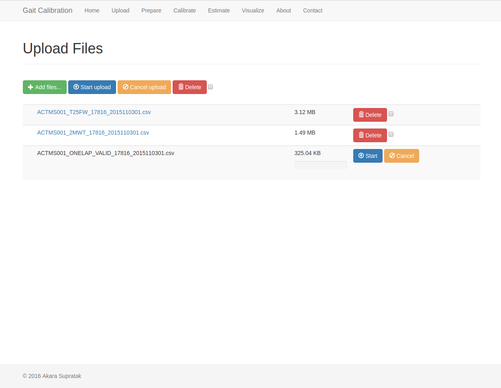
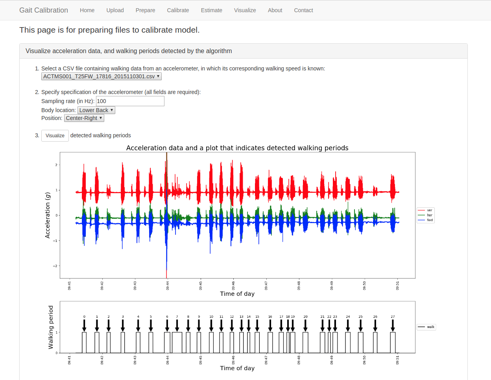
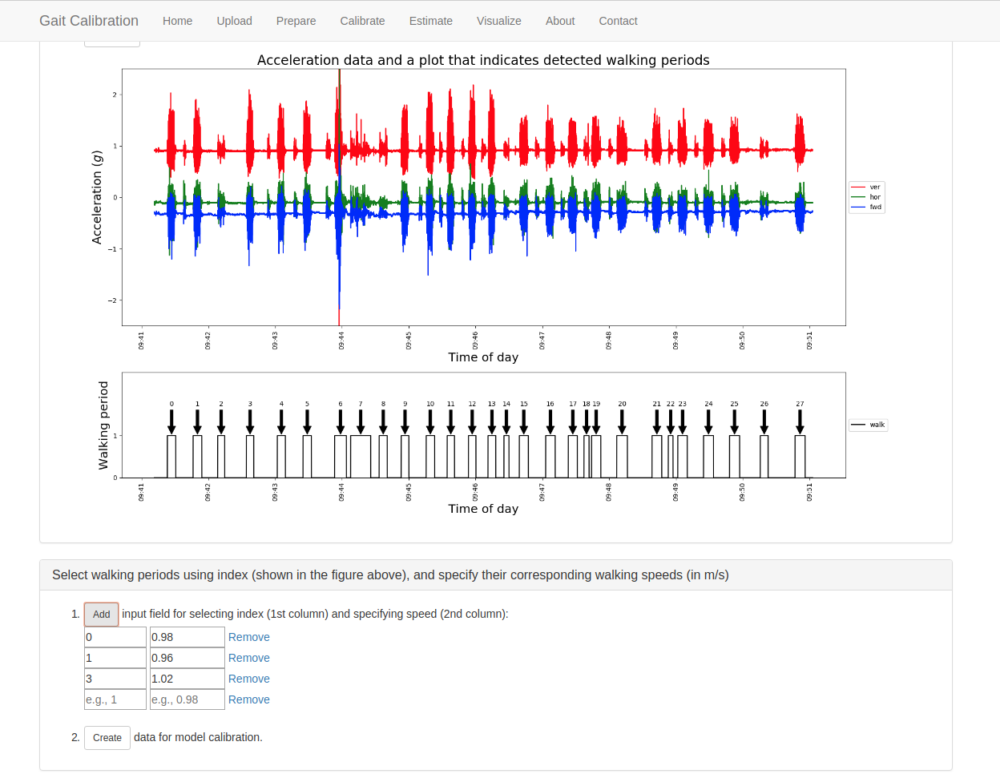
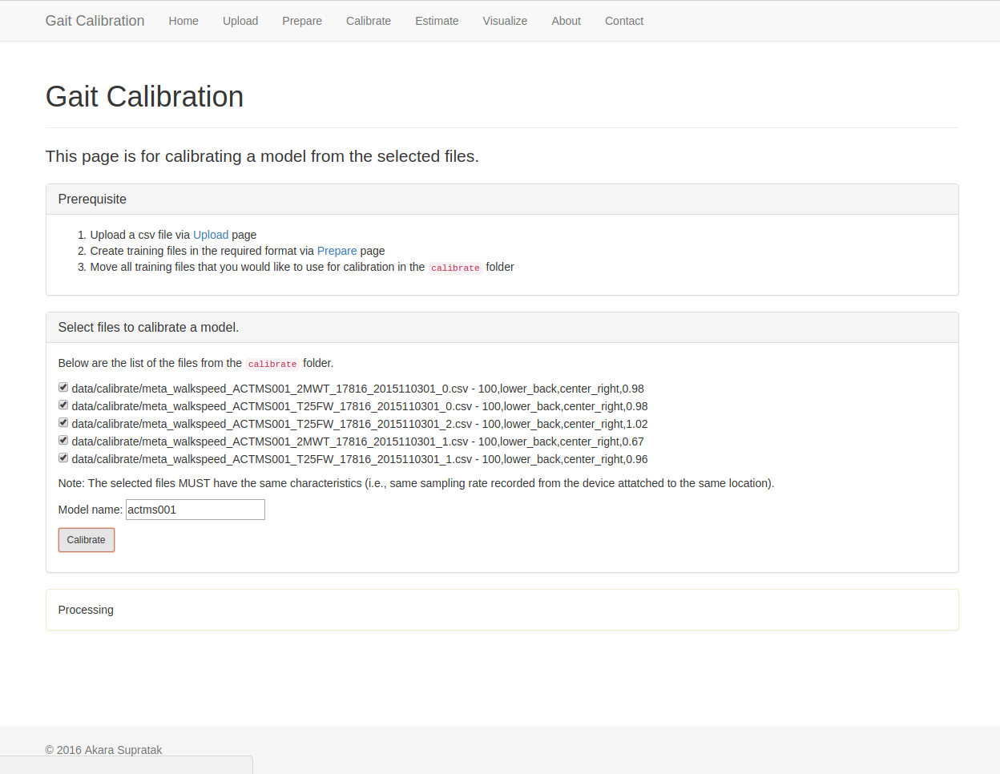
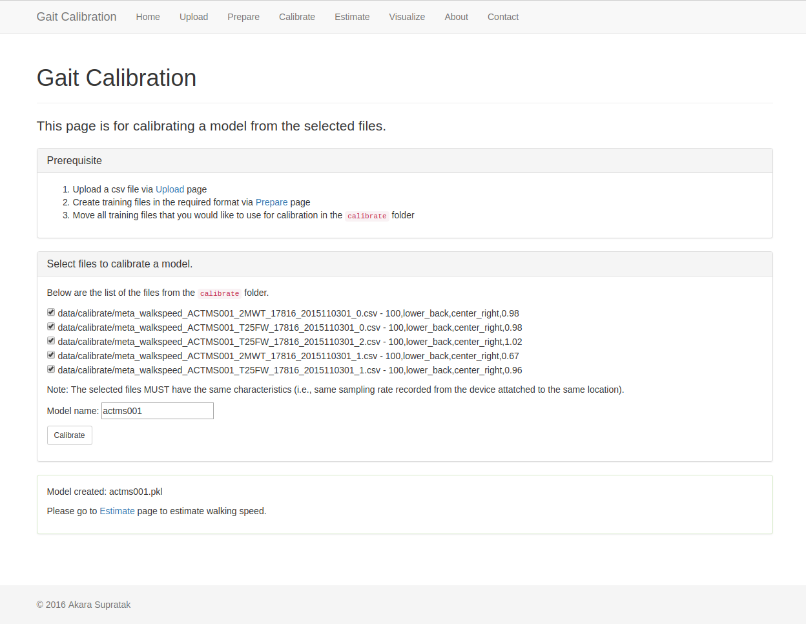
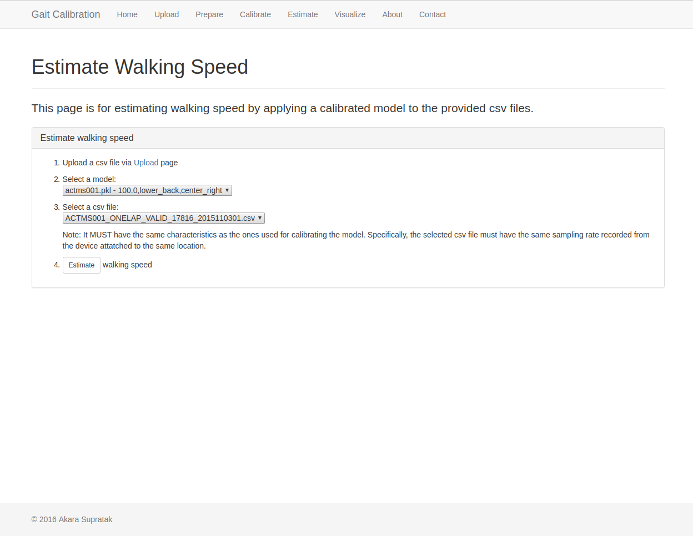
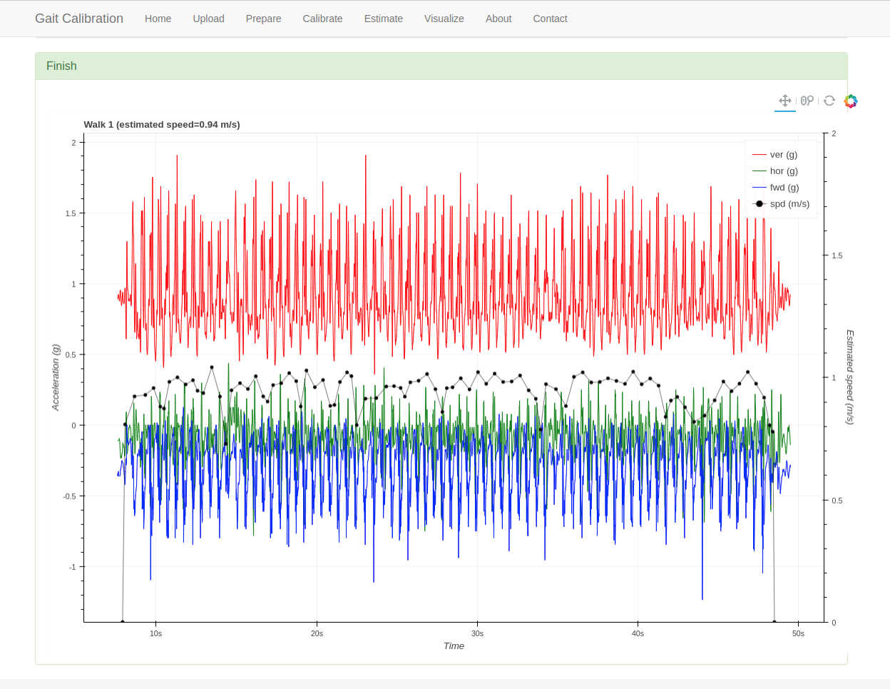

# Gait Calibration System #
A gait calibration system for personalized walking speed estimation for people with Multiple Sclerosis (MS).

## Prerequisites ##
- bokeh (0.12.4)
- Flask (0.12)
- Flask-Bootstrap (3.3.7.1)
- Flask-Script (2.0.5)
- Jinja2 (2.9.4)
- matplotlib (1.5.3)
- numpy (1.12.0)
- pandas (0.19.2)
- Pillow (4.0.0)
- pyparsing (2.1.10)
- python-dateutil (2.6.0)
- PyYAML (3.12)
- scikit-learn (0.18.1)
- scipy (0.18.1)
- simplejson (3.10.0)
- Werkzeug (0.11.15)

## How to install ##
    cd /path/to/ms-gait-calibrate
    pip install -e .

## How to calibrate via web browser ##
1. Start the flask server `python run.py`
2. Check the server IP address such as `ifconfig` in Linux
3. Open web browser then go to `http://<ip-address>:5000`
4. Go to `Upload` page and upload files  
   
5. Go to `Prepare` page to prepare files for training  
      
    
6. Go to `Calibrate` page, click `check` button to scan for the files used for training, give the name of the model, and click `Calibrate` button. Note that this process can take a while as it will calibrate a model.  
      
    
7. Go to `Estimate` page, select the uploaded file and the calibrated model, and click `Estimate` button  
      
    

## Additional helper scripts ##
These are additional scripts used to preprocess some CSV files.

### How to segment a large CSV file ###
This script is used to segment a very large CSV file collected in home environment into multiple CSV files containing 1-h of acceleration data. No preprocessing is applied here. 

    python scripts/segment_csv_data.py --csv_file /path/to/csv_file --sampling_rate 100 --body_location lower_back --position center_right --output_dir /path/to/save/output_dir

### How to extract walks from CSV files in the directory and save in an NPY file ###
Extract walks from CSV files in the specified directory. The extracted walks will be applied with `transform_orientation` to transform from `x, y, z` into `fwd, hor, ver` axes based on `body_location` and `position`. These walks will be then stored in NPY files as a list of `Acceleration` objects.

    python scripts/extract_walk.py --data_dir /path/to/directory/csv_files --output_dir /path/to/output_npy_files

### How to estimate walking speed using the trained model ###
Estimate walking speeds from CSV and NPY files that contain walks.

    python scripts/estimate_speed.py --input_file /path/to/input_csv_or_npy_file --model_file /path/to/model_file --output_dir /path/to/output_dir

### Visualize estimated walking speeds with their corresponding acceleration data ###
Visualize estimated walking speeds and their corresponding acceleration data of all walks. Each output is saved in html generated using [Bokeh](http://bokeh.pydata.org/en/latest/index.html "Bokeh").

    python visualize/speed.py --acc_file /path/to/input_csv_or_npy_file --speed_file /path/to/speed_file --output_dir /path/to/output_dir

### Reverse data collected from the device attached upside-down ###
    python scripts/reverse_csv_data.py --input_csv_file /path/to/input_csv_file --output_csv_file /path/to/output_csv_file
